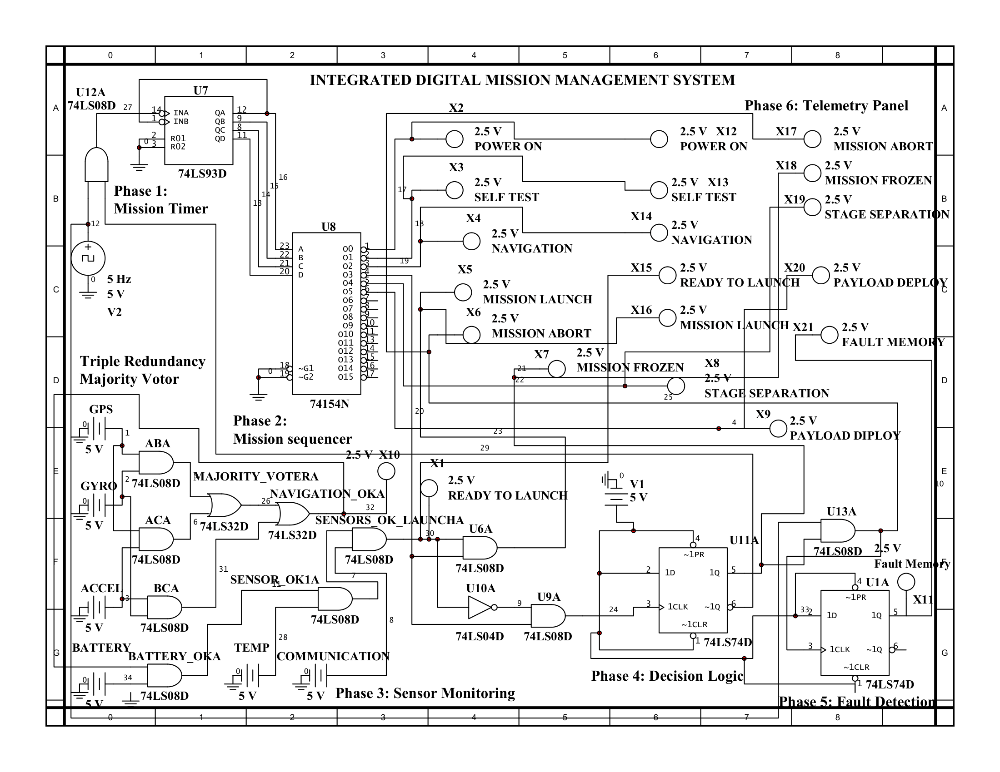

# Integrated Digital Mission Management System Using TTL Logic

*A Simplified Launch-Vehicle Mission Computer Realised Entirely in Discrete Digital Logic*



## Overview

The **Integrated Digital Mission Management System** is a simplified digital mission-control architecture designed and simulated using **TTL (Transistor-Transistor Logic) integrated circuits**.

The project demonstrates how fundamental digital logic circuits can be integrated to perform essential mission-management functions such as:

- Mission timing
- Sequential phase control
- Sensor-status monitoring
- Redundant sensor decision-making
- Mission decision logic
- Fault detection and memory
- Mission-status telemetry

Instead of using a microcontroller, microprocessor, or FPGA, the system is implemented using **discrete 74LS-series TTL logic ICs** and basic digital components.

The project is intended as an educational demonstration of how complex control functions can be constructed from fundamental digital logic blocks.

---

## Project Objectives

The main objectives of this project are:

1. To design a simplified mission-management system using discrete TTL logic.
2. To understand the operation of counters, decoders, logic gates, flip-flops, and timing circuits.
3. To implement a sequential mission-control architecture.
4. To demonstrate **Triple Redundancy Majority Voting** for sensor decision-making.
5. To implement mission decision and fault-detection logic.
6. To provide visual mission-status outputs through a telemetry panel.
7. To simulate and verify the complete digital system using **NI Multisim**.

---

## System Architecture

The system is divided into six major functional phases:

### Phase 1 — Mission Timer

The mission timer generates the timing sequence required for progressing through different stages of the mission.

A **74LS93 binary counter** is used with a clock source to generate sequential digital states.

**Main components:**

- 74LS93 counter
- 5 Hz clock source
- Reset logic
- TTL logic

---

### Phase 2 — Mission Sequencer

The mission sequencer converts the counter states into individual mission-phase signals.

A **74LS154 4-to-16 line decoder** is used to decode the binary counter outputs into individual mission states.

The decoded outputs represent different mission events such as:

- Ready to Launch
- Mission Launch
- Mission Abort
- Mission Frozen
- Stage Separation
- Payload Deployment

---

### Phase 3 — Sensor Monitoring

The sensor-monitoring section evaluates the status of multiple mission-critical sensors.

The simulated sensor inputs include:

- GPS
- Gyroscope
- Accelerometer
- Battery
- Temperature
- Communication

The system uses **logic gates** to combine and evaluate sensor states.

A major feature of this section is the use of **redundant sensor inputs and majority voting**.

---

### Triple Redundancy Majority Voting

Three redundant sensor channels are used to improve decision reliability.

The majority-voting logic follows:

```text
MAJORITY = AB + AC + BC
where:

A = Sensor Channel A
B = Sensor Channel B
C = Sensor Channel C
+ = OR operation
juxtaposition = AND operation

The output becomes HIGH when at least two of the three sensor channels indicate a valid condition.

This demonstrates the basic principle of 2-out-of-3 (2oo3) redundancy.

## Phase 4 — Decision Logic

The decision-logic section combines:

Mission sequence information
Sensor status
Majority-voter output
Control conditions

The logic determines whether the system should permit mission progression or generate an appropriate mission-state signal.

Flip-flops are used to provide sequential decision behavior and state retention.

## Phase 5 — Fault Detection

The fault-detection section monitors abnormal conditions and stores the fault state.

74LS74 D-type flip-flops are used for digital state storage.

The fault-detection logic provides a Fault Memory function, allowing a detected fault condition to be retained as a digital state.

This demonstrates the basic concept of latched fault indication used in digital control and monitoring systems.

## Phase 6 — Telemetry Panel

The telemetry panel provides visual indication of the current mission state.

The simulated telemetry outputs include:

Output	Mission Status
X1	Ready to Launch
X2	Power On
X3	Self Test
X4	Navigation
X5	Mission Launch
X6	Mission Abort
X7	Mission Frozen
X8	Stage Separation
X9	Payload Deploy
X10	Navigation OK
X11	Fault Memory
X12	Power On
X13	Self Test
X14	Navigation
X15	Ready to Launch
X16	Mission Launch
X17	Mission Abort
X18	Mission Frozen
X19	Stage Separation
X20	Payload Deploy
X21	Fault Memory

The telemetry outputs are represented using digital indicators in the Multisim simulation.

## Hardware / Logic Components

The design primarily uses components from the 74LS TTL logic family.

Major ICs Used
IC	Function
74LS93	Binary counter / mission timer
74LS154	4-to-16 line decoder / mission sequencer
74LS08	Quad 2-input AND gate
74LS32	Quad 2-input OR gate
74LS04	Hex inverter
74LS74	Dual D-type flip-flop

Additional components include:

Digital clock source
Logic power supplies
Digital switches / sensor inputs
LEDs / indicators
Logic connections
Ground connections

                 ┌─────────────────────┐
                 │    Mission Timer    │
                 │      74LS93         │
                 └──────────┬──────────┘
                            │
                            ▼
                 ┌─────────────────────┐
                 │  Mission Sequencer  │
                 │      74LS154        │
                 └──────────┬──────────┘
                            │
                            ▼
              ┌─────────────────────────────┐
              │      Mission States         │
              │ Launch / Abort / Separation │
              │ Frozen / Payload Deploy     │
              └──────────────┬──────────────┘
                             │
                             ▼
       ┌─────────────────────────────────────────┐
       │           Sensor Monitoring              │
       │ GPS │ Gyro │ Accelerometer │ Battery    │
       │ Temperature │ Communication               │
       └──────────────────┬──────────────────────┘
                          │
                          ▼
              ┌───────────────────────┐
              │  Majority Voter Logic │
              │       2-out-of-3      │
              └───────────┬───────────┘
                          │
                          ▼
              ┌───────────────────────┐
              │    Decision Logic     │
              │       74LS74          │
              └───────────┬───────────┘
                          │
                          ▼
              ┌───────────────────────┐
              │    Fault Detection    │
              │     Fault Memory      │
              └───────────┬───────────┘
                          │
                          ▼
              ┌───────────────────────┐
              │    Telemetry Panel    │
              │   Mission Indicators  │
              └───────────────────────┘

## Simulation

The complete circuit was designed and simulated using:

NI Multisim

The simulation demonstrates the interaction between the timing, sequencing, sensor-monitoring, decision, fault-detection, and telemetry sections.

## Simulation Files

The repository contains the Multisim project file:

Integrated_Digital_Mission_Management_System.ms14

Open the file in a compatible version of NI Multisim to inspect and simulate the circuit.

Repository Contents

This repository intentionally contains only the essential project files.

Integrated-Digital-Mission-Management-System/
│
├── Integrated_Digital_Mission_Management_System.ms14
├── Project_Documentation.docx
├── Mission_Management_System.png
└── README.md
File Description
File	Description
Integrated_Digital_Mission_Management_System.ms14	Complete NI Multisim circuit
Project_Documentation.docx	Detailed project documentation
Mission_Management_System.png	Complete circuit schematic
README.md	Project overview and documentation
Key Concepts Demonstrated

This project combines several important concepts from digital electronics and control-oriented systems:

TTL digital logic
Binary counting
Frequency division
Digital decoding
Sequential logic
Combinational logic
Sensor redundancy
Majority voting
Fault detection
Fault memory
Flip-flop-based state storage
Mission sequencing
Digital telemetry
System-level logic integration
Engineering Significance

Although this project is an educational simulation and not an actual flight-qualified mission computer, its architecture demonstrates several concepts relevant to aerospace and safety-critical systems.

Real aerospace systems require significantly more advanced technologies, including:

Radiation-tolerant electronics
High-reliability processors
FPGA-based logic
Real-time operating systems
Watchdog systems
Built-in test systems
Fault-tolerant architectures
Redundant computing
Formal verification
Hardware-in-the-loop testing
Rigorous safety and reliability analysis

This project provides a simplified foundation for understanding some of the digital logic principles behind such systems.

## Learning Outcomes

After completing this project, the following concepts can be understood more practically:

How digital counters generate sequential states.
How decoders convert binary states into individual control signals.
How logic gates implement decision-making.
How redundant sensor information can be combined using majority voting.
How flip-flops can retain fault information.
How multiple digital subsystems can be integrated into a larger control architecture.
How a mission sequence can be represented using discrete digital logic.

## Future Improvements
The current system can be extended in several directions:
Replace discrete logic with FPGA implementation.
Add a real-time mission clock.
Implement a more advanced fault-management architecture.
Add watchdog and timeout logic.
Introduce additional redundant computing channels.
Develop a hardware prototype using 74LS ICs.
Interface the system with a microcontroller or FPGA.
Develop a graphical telemetry interface.
Perform automated fault-injection testing.
Compare discrete TTL logic with modern digital architectures.

## Project Type
Academic / Educational Project

## Domain: Digital Electronics, Mechatronics, Aerospace Systems, Mission Management

## Simulation Platform: NI Multisim

## Logic Technology: 74LS TTL

## Author
Kunal Nitin Gadhave
Mechatronics Engineering
SVPM's College of Engineering, Malegaon (Bk.), Baramati
Academic Year: 2026–2027

## Disclaimer

This project is developed strictly for academic and educational purposes.
The system is a simplified simulation intended to demonstrate digital logic, sequencing, redundancy, decision-making, and fault-detection concepts. It is not intended for use in an actual launch vehicle, spacecraft, aircraft, or safety-critical system.

## License
This project is provided for educational and academic reference.
If you use or modify this project, please provide appropriate credit to the original author.
